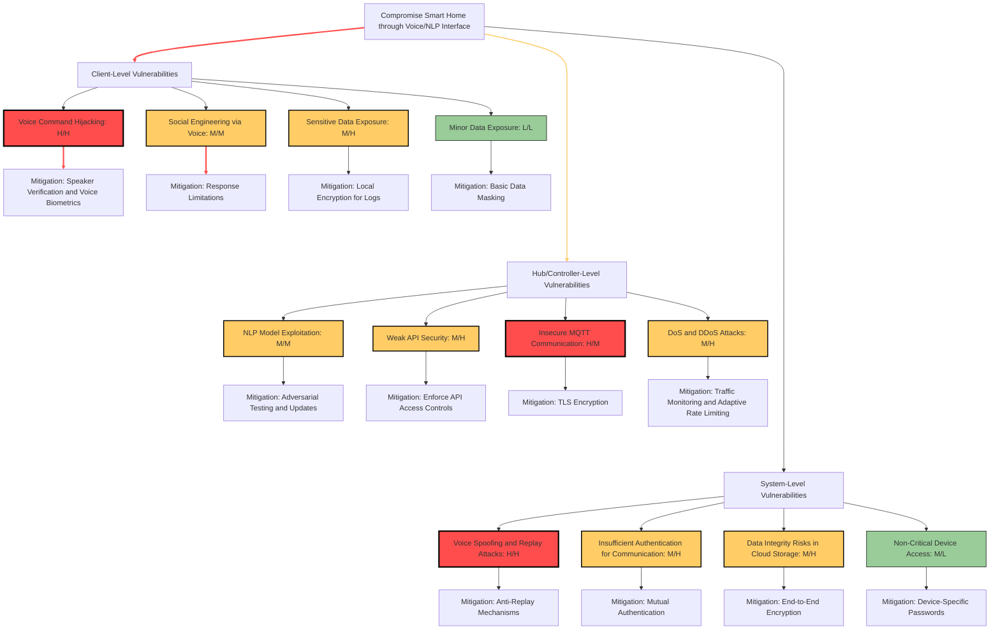

# Development Team Project: Design Document (GROUP 2)
**SSA_PCOM7E October 2024**

A smart home network leveraging Natural Language Processing (NLP) and voice recognition is vulnerable to various security threats, spanning from client-level risks to system-wide vulnerabilities. Addressing these threats is vital to safeguard user data and system functionality.

## 1. Client-Level Vulnerabilities

Voice-based security is essential for smart home systems and other critical environments, yet Automatic Speaker Verification (ASV) systems face significant risks. **Voice spoofing**, where attackers use impersonation or synthesis, is a major threat. Kassis and Hengartner (2021) note that even ASV systems with countermeasures can be fooled by adversarial examples, bypassing both machine and human verification. This highlights the limitations of current solutions and the need for more advanced biometric verification.

**Replay attacks**, where recorded commands are reused, are also concerning as they evade simple detection mechanisms (Kassis and Hengartner, 2021). **Adversarial attacks**, which modify audio samples to bypass ASV systems, further exacerbate these vulnerabilities. Khanna (2021) underscores the importance of strong speaker recognition, especially in multi-resident homes, noting how synthetic voice tools amplify these risks.

### Critical Insight:
The dependence on single-factor voice authentication underscores the need for multi-layered security solutions to adapt to adversarial advancements.

### Mitigation Strategies:
- **Voice Biometric Authentication**: Advanced verification techniques to differentiate real and spoofed voices (Kassis and Hengartner, 2021).
- **Local Encryption for Logs**: Protects sensitive voice data from breaches (Tariq et al., 2023).
- **Response Limitations**: Reduces exposure to social engineering (Khanna, 2021).
- **Basic Data Masking**: Adds another protection layer for non-critical data.

## 2. Hub/Controller-Level Vulnerabilities

**MQTT protocol**, popular for its lightweight design, has weaknesses. Hintaw et al. (2023) describe it as prone to **DoS attacks, identity spoofing, and data tampering** due to limited built-in security. The reliance on TLS/SSL is crucial but often misconfigured, increasing vulnerabilities.

The **publish/subscribe model** can be exploited to inject commands or disrupt communication. Devices with limited resources are particularly vulnerable to **DoS and DDoS attacks**, an issue magnified in IoT hubs that prioritize efficiency over security (Hintaw et al., 2023).

### Critical Insight:
While MQTT's efficiency is appealing, security gaps between innovation and practical application must be addressed with comprehensive solutions.

### Mitigation Strategies:
- **Enhanced Security Layers**: Implement TLS/SSL for encrypted communications (Hintaw et al., 2023).
- **Robust Authentication**: MFA to go beyond basic credentials (Venkatraman et al., 2021).
- **Intrusion Detection**: Adaptive monitoring to spot suspicious activity (El Kamel et al., 2022).

## 3. System-Level Vulnerabilities

**Third-party dependency risks** arise from external services for NLP and voice recognition, increasing the system's attack surface. Venkatraman et al. (2021) argue that any compromise in these services could impact the entire network.

**Voice spoofing and replay attacks** can bypass robust ASV systems using synthetic voice generation (Kassis and Hengartner, 2021). This exposes the limitations of even advanced security measures.

**Inter-Component Communication (ICC) vulnerabilities** occur when attackers intercept or spoof device communications. Hu et al. (2020) compare these to **intent hijacking and collusion** in Android systems, where attackers exploit weak communication protocols for privilege escalation and data sharing.

### Critical Insight:
The interconnected nature of smart homes requires more than securing individual components; comprehensive monitoring and interconnectivity-focused strategies are necessary.

### Mitigation Strategies:
- **Communication Analysis Tools**: Detect unauthorized data flows (Hu et al., 2020).
- **Dynamic Taint Analysis**: Ensures sensitive data isn't misused (Tariq et al., 2023).
- **Mutual Authentication**: Strengthens device-to-device security (Venkatraman et al., 2021).
- **End-to-End Encryption**: Protects cloud-stored data from tampering (Hintaw et al., 2023).

## Mitigation Table

| **Level**           | **Vulnerability**                      | **Mitigation Strategy**                                      | **Reference**                           |
|---------------------|----------------------------------------|--------------------------------------------------------------|-----------------------------------------|
| **Client**          | Voice Command Hijacking                | Implement voice biometric authentication                     | Kassis and Hengartner (2021)           |
|                     | Weak Speaker Identification            | Use advanced biometric solutions                             | Khanna (2021)                          |
|                     | Data Exposure in Logs                  | Encrypt local storage of voice command logs                  | Tariq et al. (2023)                    |
|                     | Social Engineering                     | Limit sensitive information in system responses              | Khanna (2021)                          |
| **Hub/Controller**  | NLP Model Exploitation                 | Regular updates and adversarial testing of NLP models        | Khanna (2021)                          |
|                     | Weak API Security                      | Secure APIs with OAuth and API tokens                        | Venkatraman et al. (2021)              |
|                     | Insecure MQTT Communication            | Apply TLS/SSL for encryption                                 | Hintaw et al. (2023)                   |
|                     | DoS and DDoS Attacks                   | Use traffic monitoring and adaptive rate-limiting mechanisms | El Kamel et al. (2022)                 |
| **System**          | Third-Party Dependency Risks           | Audit third-party services and have contingency plans        | Venkatraman et al. (2021)              |
|                     | Voice Spoofing and Replay Attacks      | Implement anti-replay mechanisms (e.g., timestamps, nonces)  | Kassis and Hengartner (2021)           |
|                     | Inter-Component Communication Threats  | Use communication analysis tools and taint tracking          | Hu et al. (2020)                       |
|                     | Weak Inter-Component Authentication    | Enforce strong mutual authentication protocols               | Venkatraman et al. (2021)              |
|                     | Cloud Data Integrity Risks             | Use end-to-end encryption for cloud-stored data              | Hintaw et al. (2023)                   |

## Attack/Defense (A/D) Tree

## References

- Ding, W., Liao, S., Cheng, L., Mi, X., Zhao, Z. and Hu, H. (2024) ‘Command hijacking on voice-controlled IoT in Amazon Alexa platform’, in *Proceedings of the 19th ACM Asia Conference on Computer and Communications Security*.
- Kassis, A. and Hengartner, U. (2021) ‘Practical attacks on voice spoofing countermeasures’, *arXiv preprint arXiv:2107.14642*.
- Hintaw, A.J., Manickam, S., Aboalmaaly, M.F. and Karuppayah, S. (2023) ‘MQTT vulnerabilities, attack vectors and solutions in the internet of things (IoT)’, *IETE Journal of Research*, 69(6), pp. 3368-3397.
- El Kamel, A., Eltaief, H. and Youssef, H. (2022) ‘On-the-fly (D)DoS attack mitigation in SDN using Deep Neural Network-based rate limiting’, *Computer Communications*, 182, pp. 153-169.
- Hu, Y., Jin, Z., Li, W., Xiang, Y. and Zhang, J. (2020) ‘SIAT: A systematic inter-component communication analysis technology for detecting threats on Android’, *arXiv preprint arXiv:2006.12831*.
- Rios, E., Rego, A., Iturbe, E., Higuero, M. and Larrucea, X. (2020) ‘Continuous quantitative risk management in smart grids using attack defense trees’, *Sensors*, 20(16), 4404. Available at: https://doi.org/10.3390/s20164404.
- Khanna, S. (2021) ‘Identifying privacy vulnerabilities in key stages of computer vision, natural language processing, and voice processing systems’, *International Journal of Business Intelligence and Big Data Analytics*, 4(1), pp. 1-11.
- Venkatraman, S., Overmars, A. and Thong, M. (2021) ‘Smart home automation—use cases of a secure and integrated voice-control system’, *Systems*, 9(4), p. 77.
- Tariq, U., Ahmed, I., Bashir, A.K. and Shaukat, K. (2023) ‘A critical cybersecurity analysis and future research directions for the internet of things: a comprehensive review’, *Sensors*, 23(8), p. 4117.
