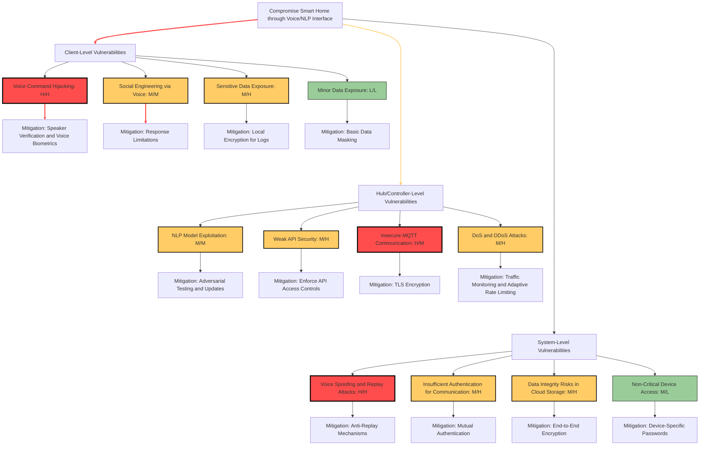

# Development Team Project: Design Document (GROUP 2)
**SSA_PCOM7E October 2024**

A smart home network that leverages Natural Language Processing (NLP) and voice recognition is vulnerable to various security threats. These vulnerabilities span from client-level risks to systemic issues within the broader interconnected framework. Addressing these potential security breaches is vital to safeguard user data and system integrity.

## Client-Level Vulnerabilities

Voice-based security mechanisms have become integral in smart home systems and other security-critical environments, such as banking and call centers. However, Automatic Speaker Verification (ASV) systems used for authentication face significant risks. Voice spoofing is a critical threat where attackers mimic user voiceprints through techniques like impersonation, voice synthesis, and replay attacks. Kassis and Hengartner (2021) emphasize that even ASV systems equipped with spoofing countermeasures (CMs) can be deceived by adversarial examples that sound identical to the legitimate user's voice, bypassing both machine detection and human review. This demonstrates the limitations of current countermeasures and underscores the need for continuous innovation in biometric verification.

Replay attacks pose another significant risk, where previously recorded voice commands are reused to gain unauthorized access. These attacks are particularly concerning because they often circumvent basic detection mechanisms, exposing the system to repeated breaches (Kassis and Hengartner, 2021). Adversarial attacks, which modify audio samples to fool ASV systems and bypass countermeasures, are also prevalent. Khanna (2021) discusses how weak speaker recognition, especially in multi-resident environments, can result in unauthorized access and emphasizes the critical role of robust biometric solutions. The ease of producing synthetic voice samples using publicly available tools only exacerbates these challenges.

While advancements in voice authentication continue, the industry must remain vigilant in adapting to new methods of adversarial attacks. The reliance on single-factor voice authentication exposes systems to manipulation, highlighting the importance of layered security approaches that integrate multiple verification techniques.

### Mitigation Strategies:
- **Voice Biometric Authentication**: Implementing advanced speaker verification techniques helps distinguish between legitimate and spoofed voices (Kassis and Hengartner, 2021).
- **Local Encryption for Logs**: Encrypting stored voice data ensures that sensitive information is protected from unauthorized access and potential data breaches (Tariq et al., 2023).
- **Response Limitations**: Limiting the type and amount of information exposed during interactions minimizes the success of social engineering attacks (Khanna, 2021).
- **Basic Data Masking**: Masking less critical data can add an additional layer of protection, reducing its value to potential attackers.

## Hub/Controller-Level Vulnerabilities

At the hub/controller level, vulnerabilities extend to how data is processed and communicated. The MQTT protocol, commonly used in IoT for its lightweight and efficient communication, has notable weaknesses. Hintaw et al. (2023) outline that MQTT is susceptible to denial of service (DoS), identity spoofing, information disclosure, and data tampering due to its limited built-in security features. The reliance on external protocols like TLS/SSL is critical for data protection, yet often overlooked or improperly configured in practical implementations.

The publish/subscribe model of MQTT can be exploited, enabling attackers to inject unauthorized commands or disrupt system communication. Devices with limited processing resources exacerbate this vulnerability, making them highly susceptible to DoS and DDoS attacks (Hintaw et al., 2023). This risk is magnified by the increasing use of IoT hubs that prioritize efficiency over security.

While lightweight protocols like MQTT are attractive for IoT environments, their inherent vulnerabilities suggest a gap between innovation and secure application. Organizations should not only rely on standard encryption but must also integrate comprehensive security measures that include continuous monitoring and adaptive protection to handle the evolving nature of these threats.

### Mitigation Strategies:
- **Enhanced Security Layers**: Implementing TLS/SSL for end-to-end encryption is essential for securing MQTT communications (Hintaw et al., 2023).
- **Robust Authentication Mechanisms**: Using multi-factor authentication (MFA) ensures that access is protected beyond basic username/password credentials (Venkatraman, Overmars, and Thong, 2021).
- **Intrusion Detection and Traffic Monitoring**: Employing adaptive traffic analysis and deep learning techniques helps identify and mitigate suspicious activities (El Kamel et al., 2022).

## System-Level Vulnerabilities

System-level vulnerabilities impact the entire ecosystem of connected devices. Third-party dependency risks arise from the use of external services for NLP processing and voice recognition. Venkatraman, Overmars, and Thong (2021) argue that the dependency on third-party APIs increases the system's attack surface, and any compromise or malfunction of these services can propagate through the entire network. This highlights a critical vulnerability in the interconnected nature of smart home systems.

Voice spoofing and replay attacks at the system level can bypass even robust ASV systems through the use of advanced synthetic voice generation. Kassis and Hengartner (2021) showcase the ability of attackers to use machine learning algorithms to replicate user voices with high accuracy, challenging the efficacy of existing countermeasures.

Inter-Component Communication (ICC) vulnerabilities add another layer of risk. Unauthorized interception or spoofing of device communications can lead to command manipulation and unauthorized control. Hu et al. (2020) draw parallels to intent hijacking and collusion attacks seen in Android systems, where attackers exploit weaknesses in communication protocols to escalate privileges or share sensitive data between compromised devices.

The integration of multiple devices and external services in smart homes underscores a pressing need for holistic security approaches. Ensuring the resilience of each component is not sufficient; organizations must establish comprehensive monitoring and mitigation strategies that address interconnectivity risks.

### Mitigation Strategies:
- **Communication Analysis Tools**: Adapting tools like SIAT to monitor and trace inter-device communications can help detect unauthorized or suspicious data flows (Hu et al., 2020).
- **Dynamic Taint Analysis**: This technique tracks data paths to ensure that sensitive information is not transferred or exposed through unauthorized channels (Tariq et al., 2023).
- **Mutual Authentication Protocols**: Strengthening authentication between devices can reduce risks of unauthorized access and control (Venkatraman, Overmars, and Thong, 2021).
- **End-to-End Encryption**: Ensuring robust encryption for cloud-stored data protects against unauthorized access and potential tampering (Hintaw et al., 2023).

## Mitigation Table

| **Level**           | **Vulnerability**                      | **Mitigation Strategy**                                      | **Reference**                           |
|---------------------|----------------------------------------|--------------------------------------------------------------|-----------------------------------------|
| **Client**          | Voice Command Hijacking                | Implement voice biometric authentication                     | Kassis and Hengartner (2021)           |
|                     | Weak Speaker Identification            | Use advanced biometric solutions                             | Khanna (2021)                          |
|                     | Data Exposure in Logs                  | Encrypt local storage of voice command logs                  | Tariq et al. (2023)                    |
|                     | Social Engineering                     | Limit sensitive information in system responses              | Khanna (2021)                          |
| **Hub/Controller**  | NLP Model Exploitation                 | Regular updates and adversarial testing of NLP models        | Khanna (2021)                          |
|                     | Weak API Security                      | Secure APIs with OAuth and API tokens                        | Venkatraman et al. (2021)              |
|                     | Insecure MQTT Communication            | Apply TLS/SSL for encryption                                 | Hintaw et al. (2023)                   |
|                     | DoS and DDoS Attacks                   | Use traffic monitoring and adaptive rate-limiting mechanisms | El Kamel et al. (2022)                 |
| **System**          | Third-Party Dependency Risks           | Audit third-party services and have contingency plans        | Venkatraman et al. (2021)              |
|                     | Voice Spoofing and Replay Attacks      | Implement anti-replay mechanisms (e.g., timestamps, nonces)  | Kassis and Hengartner (2021)           |
|                     | Inter-Component Communication Threats  | Use communication analysis tools and taint tracking          | Hu et al. (2020)                       |
|                     | Weak Inter-Component Authentication    | Enforce strong mutual authentication protocols               | Venkatraman et al. (2021)              |
|                     | Cloud Data Integrity Risks             | Use end-to-end encryption for cloud-stored data              | Hintaw et al. (2023)                   |

## Attack/Defense (A/D) Tree

## References

- Ding, W., Liao, S., Cheng, L., Mi, X., Zhao, Z. and Hu, H. (2024) ‘Command hijacking on voice-controlled IoT in Amazon Alexa platform’, in *Proceedings of the 19th ACM Asia Conference on Computer and Communications Security*.
- Kassis, A. and Hengartner, U. (2021) ‘Practical attacks on voice spoofing countermeasures’, *arXiv preprint arXiv:2107.14642*.
- Hintaw, A.J., Manickam, S., Aboalmaaly, M.F. and Karuppayah, S. (2023) ‘MQTT vulnerabilities, attack vectors and solutions in the internet of things (IoT)’, *IETE Journal of Research*, 69(6), pp. 3368-3397.
- El Kamel, A., Eltaief, H. and Youssef, H. (2022) ‘On-the-fly (D)DoS attack mitigation in SDN using Deep Neural Network-based rate limiting’, *Computer Communications*, 182, pp. 153-169.
- Hu, Y., Jin, Z., Li, W., Xiang, Y. and Zhang, J. (2020) ‘SIAT: A systematic inter-component communication analysis technology for detecting threats on Android’, *arXiv preprint arXiv:2006.12831*.
- Rios, E., Rego, A., Iturbe, E., Higuero, M. and Larrucea, X. (2020) ‘Continuous quantitative risk management in smart grids using attack defense trees’, *Sensors*, 20(16), 4404. Available at: https://doi.org/10.3390/s20164404.
- Khanna, S. (2021) ‘Identifying privacy vulnerabilities in key stages of computer vision, natural language processing, and voice processing systems’, *International Journal of Business Intelligence and Big Data Analytics*, 4(1), pp. 1-11.
- Venkatraman, S., Overmars, A. and Thong, M. (2021) ‘Smart home automation—use cases of a secure and integrated voice-control system’, *Systems*, 9(4), p. 77.
- Tariq, U., Ahmed, I., Bashir, A.K. and Shaukat, K. (2023) ‘A critical cybersecurity analysis and future research directions for the internet of things: a comprehensive review’, *Sensors*, 23(8), p. 4117.
